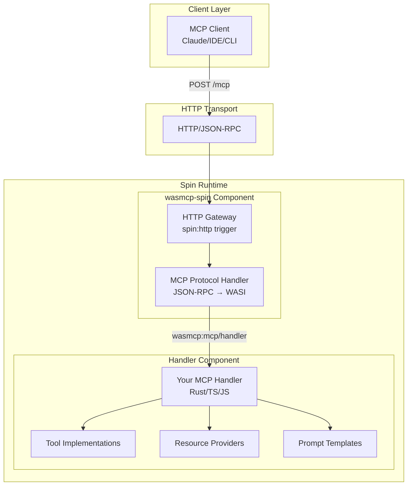

<div align="center">

# `wasmcp`

[WebAssembly components](https://component-model.bytecodealliance.org/introduction.html) for building [MCP (Model Context Protocol)](https://modelcontextprotocol.io/introduction) servers
</div>

## Overview

This repository provides a way to compose MCP servers as WebAssembly components. These components can run on any WebAssembly runtime that supports the component model, including:

- **Spin** - Fermyon's WebAssembly framework
- **Wasmtime** - Bytecode Alliance's WebAssembly runtime
- Any other WASI-compatible runtime

### Contents

1. **wit** - Wasm Interface Types defining the MCP component interfaces
2. **wasmcp-spin** - A Spin-specific WebAssembly component that exposes an MCP server over HTTP, delegating business logic to a MCP handler component
3. **wasmcp** (Rust) - SDK for building MCP handler components in Rust
4. **wasmcp** (TypeScript) - SDK for building MCP handler components in TypeScript/JavaScript
5. **templates** - Spin templates for easily managing MCP projects

## Architecture



The architecture consists of three layers:

1. **Client Layer**: Any MCP-compatible client (Claude Desktop, IDE extensions, CLI tools)
2. **Gateway Component** (`wasmcp-spin`): Handles HTTP transport and protocol translation
3. **Handler Component**: Your business logic implementing MCP tools, resources, and prompts

The gateway component:
- Exposes an HTTP endpoint at `/mcp` for JSON-RPC requests
- Translates between HTTP/JSON-RPC and WASI component calls
- Manages request/response lifecycle and error handling

## Quick Start with Spin

### Installing Templates

First, install the wasmcp templates:

```bash
spin templates install --git https://github.com/fastertools/ftl-components
```

This installs three templates:
- `wasmcp-rust` - For building MCP handlers in Rust
- `wasmcp-typescript` - For building MCP handlers in TypeScript
- `wasmcp-javascript` - For building MCP handlers in JavaScript

### Creating a New MCP Server

1. **Create a new Spin application with an MCP handler:**
   ```bash
   # Rust
   spin new -t wasmcp-rust my-mcp-server
   
   # TypeScript
   spin new -t wasmcp-typescript my-mcp-server
   
   # JavaScript  
   spin new -t wasmcp-javascript my-mcp-server
   ```

2. **Build and run:**
   ```bash
   cd my-mcp-server
   spin build
   spin up
   ```

3. **Test your MCP server:**
   ```bash
   # List available tools
   curl -X POST http://localhost:3000/mcp \
     -H "Content-Type: application/json" \
     -d '{
       "jsonrpc": "2.0",
       "method": "tools/list",
       "params": {},
       "id": 1
     }'
   
   # Call a tool
   curl -X POST http://localhost:3000/mcp \
     -H "Content-Type: application/json" \
     -d '{
       "jsonrpc": "2.0",
       "method": "tools/call",
       "params": {
         "name": "echo",
         "arguments": {
           "message": "Hello, MCP!"
         }
       },
       "id": 2
     }'
   ```

### Adding MCP to an Existing Spin App

If you already have a Spin application, you can add an MCP component:

```bash
# Add a TypeScript MCP handler
spin add -t wasmcp-typescript my-handler

# Add a Rust MCP handler  
spin add -t wasmcp-rust my-handler

# Then build and run as usual
spin build
spin up
```

### Development with File Watching

Use `spin watch` for automatic rebuilds during development:

```bash
spin watch
```

This will automatically rebuild your MCP handler when you modify source files.

## Development

### Prerequisites

- Rust toolchain with `wasm32-wasip1` target
- Node.js 20+
- cargo-component (`cargo install --locked cargo-component`)
- wasm-tools (`cargo install --locked wasm-tools`)

### Common Commands

```bash
# Show all available commands
make help

# Install dependencies and tools
make install-deps

# Build everything
make build-all

# Run all tests
make test-all

# Full CI pipeline (build + test)
make ci
```

## Repository Structure

```
ftl-components/
├── wit/                    # Shared WIT interface definitions
│   └── mcp.wit            # MCP handler interface and world
├── src/
│   ├── components/
│   │   └── wasmcp-spin/  # Spin HTTP gateway component
│   │       └── wit/           # Gateway-specific WIT files
│   └── sdk/
│       ├── wasmcp-rust/       # Rust SDK
│       └── wasmcp-typescript/ # TypeScript SDK
├── templates/             # Project templates
└── scripts/               # Build and version management scripts
```

## Version Management

This repository uses a centralized version management system. All component versions are managed through `versions.toml`.

### Quick Commands

```bash
# Show current versions
make show-versions

# Bump all packages by patch version (e.g., 0.1.2 → 0.1.3)
make bump-all-patch

# Bump all packages by minor version (e.g., 0.1.2 → 0.2.0)
make bump-all-minor

# Bump individual packages
make bump-rust-patch      # Bump Rust SDK patch version
make bump-gateway-minor   # Bump HTTP gateway minor version
make bump-ts-patch       # Bump TypeScript SDK patch version

# Ensure versions are in sync
make sync-versions

# Sync WIT files from root to templates
make sync-wit

# Validate WIT files are in sync
make validate-wit
```

### How It Works

1. **Single Source of Truth**: `versions.toml` contains all version information
2. **Automatic Propagation**: Version changes are automatically synced to:
   - Package files (Cargo.toml, package.json)
   - Template dependencies
   - Gateway component references
   - Documentation

3. **CI Validation**: Pull requests are checked to ensure version and WIT file consistency

### Release Process

#### Automated Release (Recommended)

```bash
# For patch release (bug fixes)
make release-patch

# For minor release (new features)
make release-minor

# Then follow the instructions printed by make
```

#### Manual Publishing

If you need to publish packages manually:

```bash
# Dry run first to verify
make publish-dry-run

# Publish individual packages
make publish-gateway      # Publish to ghcr.io
make publish-rust-sdk    # Publish to crates.io  
make publish-ts-sdk      # Publish to npm

# Or publish everything at once (use with caution!)
make publish-all
```

**Note**: The GitHub Actions workflow handles publishing automatically when you push version tags. Manual publishing is only needed for special cases.

For more details, see [Version Management Scripts](./scripts/README.md).

## Documentation

- [WIT Interface Documentation](./wit/README.md)
- [Rust SDK Documentation](./src/sdk/wasmcp-rust/README.md)
- [TypeScript SDK Documentation](./src/sdk/wasmcp-typescript/README.md)
- [Spin HTTP Gateway Documentation](./src/components/wasmcp-spin/README.md)