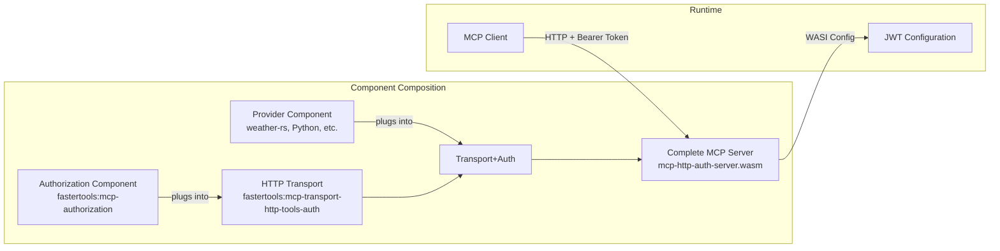
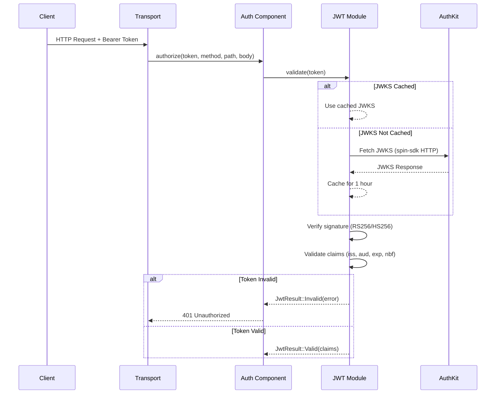
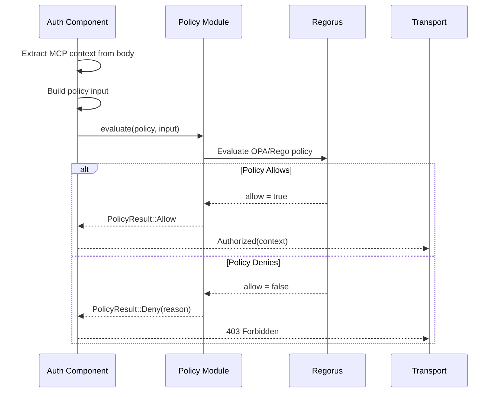

# MCP Authorization Flow: JWT Validation & OPA Policy Evaluation

## Overview

The authorization component implements a two-stage security model:
1. **Authentication** via JWT validation (jsonwebtoken crate)
2. **Authorization** via OPA policy evaluation (Regorus engine)

## Component Architecture

The MCP authorization system uses WebAssembly Component Model composition to create secure servers:



### Component Packages

Published to the `fastertools` namespace on ghcr.io:

1. **Authorization Component** (`fastertools:mcp-authorization@0.1.0`)
   - JWT validation with JWKS support
   - OPA/Rego policy evaluation
   - OAuth 2.0 discovery endpoints
   - ~1.8MB (includes Regorus engine)

2. **HTTP Transport Components**
   - `fastertools:mcp-transport-http-tools@0.1.0` - Without auth
   - `fastertools:mcp-transport-http-tools-auth@0.1.0` - With auth imports
   - ~550KB each

3. **Provider Components** (your implementation)
   - Implements MCP tools, resources, etc.
   - Language-specific (Rust, Python, Go, etc.)

### Composition Process

```bash
# Step 1: Authorization plugs into Transport
wac plug --plug mcp-authorization.wasm \
         mcp-transport-http-tools-auth.wasm \
         -o transport-with-auth.wasm

# Step 2: Provider plugs into authorized transport  
wac plug --plug weather-rs.wasm \
         transport-with-auth.wasm \
         -o mcp-http-auth-server.wasm
```

Or using registry packages:
```bash
# Download from registry
wkg get fastertools:mcp-authorization@0.1.0 -o auth.wasm
wkg get fastertools:mcp-transport-http-tools-auth@0.1.0 -o transport.wasm

# Compose
wac plug --plug auth.wasm transport.wasm -o transport-auth.wasm
wac plug --plug provider.wasm transport-auth.wasm -o server.wasm
```

## Detailed Flow Sequence

### Stage 1: JWT Token Validation



### JWT Validation Details

The `jsonwebtoken` crate is used for:

1. **Signature Verification**:
   - Fetches JWKS from issuer's endpoint
   - Supports RS256 (RSA) and HS256 (HMAC) algorithms
   - Matches `kid` (key ID) from token header to JWKS
   - Verifies signature using public key from JWKS

2. **Claims Validation**:
   ```rust
   validation.set_issuer(&[expected_issuer]);      // Must match
   validation.set_audience(&[expected_audience]);   // Must match
   validation.validate_exp = true;                  // Not expired
   validation.validate_nbf = true;                  // Not before
   ```

3. **JWKS Caching**:
   - Caches JWKS for 1 hour to reduce network calls
   - Thread-safe using `Lazy<Mutex<HashMap>>`

### Stage 2: OPA Policy Authorization

After JWT validation succeeds, the component evaluates authorization policies:



### Policy Input Structure

The policy receives comprehensive context:

```json
{
  "token": {
    "sub": "user-123",
    "iss": "https://auth.example.com",
    "aud": ["client_ABC"],
    "scopes": ["mcp:tools:read", "mcp:tools:write"],
    "client_id": "client_ABC"
  },
  "request": {
    "method": "POST",
    "path": "/mcp",
    "headers": {
      "content-type": "application/json"
    }
  },
  "mcp": {
    "method": "tools/call",
    "tool": "dangerous_tool",
    "arguments": {...}
  }
}
```

### Policy Modes

1. **Default Mode** (Permissive):
   ```rego
   package mcp.authorization
   default allow = true  # All authenticated users allowed
   ```

2. **RBAC Mode** (Role-based):
   ```rego
   allow if {
       input.mcp.method == "tools/call"
       input.token.scopes[_] == "mcp:tools:write"
   }
   ```

3. **Custom Mode**: User-provided OPA policy via config

## Security Guarantees

1. **No Token Passthrough**: Raw tokens never leave the auth component
2. **Fail Secure**: Default deny if policy evaluation fails
3. **Signature Verification**: Cryptographic proof of token authenticity
4. **Claims Validation**: Ensures token is for this service and not expired
5. **Policy Isolation**: Each request evaluated independently

## HTTP Status Codes

- **401 Unauthorized**: JWT validation failed (invalid/expired/missing token)
- **403 Forbidden**: JWT valid but policy denied access (insufficient scope)
- **500 Internal Server Error**: Policy evaluation error

## Configuration

### Runtime Configuration (WASI Config)

The composed server accepts configuration via wasmtime's `-Sconfig` flag:

```bash
wasmtime serve -Scli -Sconfig \
  -Sconfig-var="jwt.expected_issuer=https://auth.example.com" \
  -Sconfig-var="jwt.expected_audience=client_123" \
  -Sconfig-var="jwt.jwks_uri=https://auth.example.com/.well-known/jwks.json" \
  mcp-http-auth-server.wasm
```

### Required for JWT Validation
```bash
jwt.expected_issuer=https://auth.example.com     # Token issuer
jwt.expected_audience=client_123                 # Expected audience
jwt.jwks_uri=https://auth.example.com/.well-known/jwks.json
```

### Optional Policy Configuration
```bash
policy.mode=rbac           # default|rbac|custom|none
policy.content=<rego>      # For custom mode
jwt.validation_leeway=60   # Clock skew tolerance in seconds
```

### AuthKit/WorkOS Integration

Works seamlessly with AuthKit, for example:

```bash
export JWT_ISSUER="https://your-domain.authkit.app"
export JWT_AUDIENCE="client_YOUR_CLIENT_ID"
export JWT_JWKS_URI="https://your-domain.authkit.app/oauth2/jwks"

wasmtime serve -Scli -Sconfig \
  -Sconfig-var="jwt.expected_issuer=$JWT_ISSUER" \
  -Sconfig-var="jwt.expected_audience=$JWT_AUDIENCE" \
  -Sconfig-var="jwt.jwks_uri=$JWT_JWKS_URI" \
  mcp-http-auth-server.wasm
```

## Key Implementation Files

- `src/jwt.rs`: JWT validation using jsonwebtoken crate
- `src/policy.rs`: OPA policy evaluation using Regorus
- `src/lib.rs`: Orchestrates JWT → Policy flow
- `src/config.rs`: WASI config integration

## Quick Start Example

Using the weather-rs example with authentication:

```bash
# Clone and navigate to example
git clone <repo>
cd examples/weather-rs

# Build with auth (downloads components from registry)
make build-auth

# Configure and run
export JWT_ISSUER="https://your-domain.authkit.app"
export JWT_AUDIENCE="client_YOUR_CLIENT_ID"
export JWT_JWKS_URI="https://your-domain.authkit.app/oauth2/jwks"
make serve-auth

# The server now:
# - Provides OAuth discovery at /.well-known/oauth-*
# - Validates JWT tokens on all /mcp requests
# - Applies OPA policies for fine-grained access control
```

## Testing the Flow

1. **Test without token** (401):
   ```bash
   curl -X POST http://localhost:8080/mcp \
        -H "Content-Type: application/json" \
        -d '{"jsonrpc":"2.0","method":"tools/list","id":1}'
   ```

2. **Test OAuth discovery**:
   ```bash
   curl http://localhost:8080/.well-known/oauth-protected-resource
   curl http://localhost:8080/.well-known/oauth-authorization-server
   ```

3. **Test with valid token** (200):
   ```bash
   curl -X POST http://localhost:8080/mcp \
        -H "Authorization: Bearer $TOKEN" \
        -H "Content-Type: application/json" \
        -d '{"jsonrpc":"2.0","method":"tools/list","id":1}'
   ```

## Component Sizes

- **Authorization**: ~1.8MB (includes Regorus policy engine)
- **Transport (no auth)**: ~550KB
- **Transport (with auth)**: ~550KB  
- **Weather-rs provider**: ~350KB
- **Final composed server**: ~2.7MB (all components combined)