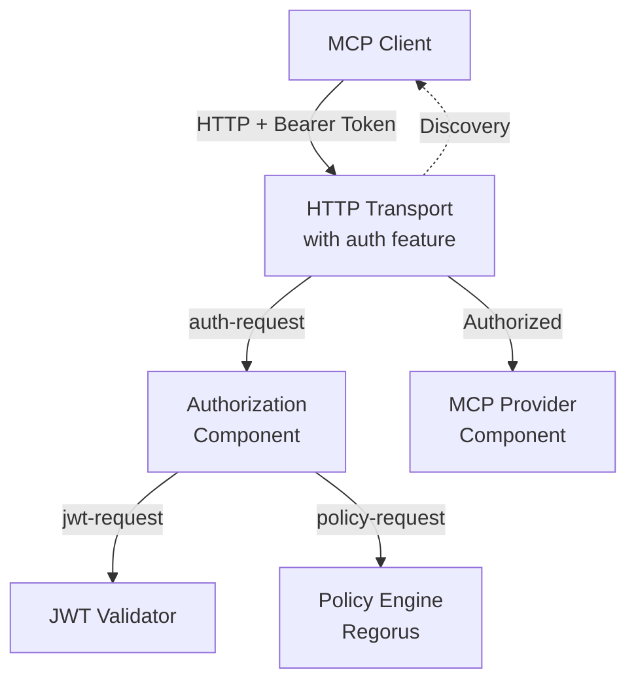
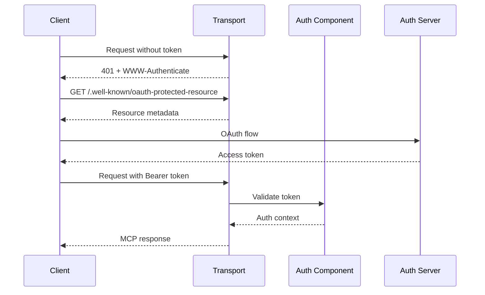

# Authorization System for wasmcp

This document describes the comprehensive authorization system implemented for wasmcp, providing OAuth 2.0 compliant authentication and policy-based authorization for MCP servers.

## Overview

The wasmcp authorization system implements a **component-based authorization architecture** that provides:

- **OAuth 2.0 Bearer Token Authentication** per RFC 6749
- **JWT Token Validation** with JWKS support
- **Policy-Based Authorization** using OPA/Rego
- **OAuth Discovery Endpoints** per RFC 8414 and RFC 9728
- **Fine-Grained Access Control** for MCP methods, tools, and resources
- **Component Model Integration** for zero-overhead authorization

## Architecture



## Components

### 1. Authorization Component (`components/authorization/`)

The core authorization component that:
- Validates JWT tokens
- Evaluates OPA/Rego policies
- Provides OAuth discovery metadata
- Implements MCP-specific authorization

### 2. HTTP Transport with Auth (`components/http-transport/`)

Enhanced HTTP transport that:
- Extracts bearer tokens from requests
- Calls authorization component
- Serves OAuth discovery endpoints
- Returns proper OAuth error responses

### 3. WIT Interfaces (`wit/authorization.wit`)

WebAssembly Interface Types defining:
- Authorization request/response types
- JWT validation interface
- Policy engine interface
- OAuth discovery interface
- MCP-specific authorization helpers

## OAuth 2.0 Flow

The implementation follows the MCP specification for OAuth 2.0:



## Configuration

### Environment Variables

```bash
# JWT Validation
export MCP_EXPECTED_ISSUER=https://auth.example.com
export MCP_EXPECTED_AUDIENCE=https://mcp.example.com
export MCP_JWKS_URI=https://auth.example.com/.well-known/jwks.json

# OAuth Discovery
export MCP_RESOURCE_URL=https://mcp.example.com
export MCP_AUTH_SERVER=https://auth.example.com
export MCP_AUTH_ENDPOINT=https://auth.example.com/authorize
export MCP_TOKEN_ENDPOINT=https://auth.example.com/token
```

### Transport Features

Enable authorization in the HTTP transport:

```toml
# components/http-transport/Cargo.toml
[features]
default = ["full", "auth"]
auth = []  # OAuth 2.0 authorization support
```

## Policy System

### Default Policy

The default policy implements basic OAuth scope-based authorization:

```rego
package mcp.authorization

allow if {
    input.token.sub != ""
    input.mcp.method == "tools/call"
    "mcp:tools:write" in input.token.scopes
    tool_allowed
}
```

### Custom Policies

Policies can be customized for specific requirements:

1. **RBAC Policy** - Role-based access control
2. **Tool Authorization** - Fine-grained tool access
3. **Resource Protection** - URI-based resource control
4. **Rate Limiting** - Request throttling

### Policy Input Structure

```json
{
  "token": {
    "sub": "user123",
    "iss": "https://auth.example.com",
    "scopes": ["mcp:tools:write"],
    "claims": {}
  },
  "request": {
    "method": "POST",
    "path": "/mcp",
    "headers": {}
  },
  "mcp": {
    "method": "tools/call",
    "tool": "example_tool",
    "arguments": {}
  }
}
```

## Security Features

### 1. Token Validation
- Signature verification using JWKS
- Expiration and not-before checks
- Issuer and audience validation
- Clock skew tolerance

### 2. Scope-Based Authorization
- Method-level scopes (e.g., `mcp:tools:read`)
- Tool-specific scopes (e.g., `admin`, `finance`)
- Resource-level scopes (e.g., `sensitive`)

### 3. Policy Enforcement
- Default deny unless explicitly allowed
- Audit logging capability
- Denial reason reporting
- Contextual authorization

### 4. OAuth Compliance
- RFC 6749: OAuth 2.0 Framework
- RFC 8414: Authorization Server Metadata
- RFC 9728: Protected Resource Metadata
- RFC 8707: Resource Indicators

## Building and Testing

### Build Authorization Component

```bash
cd components/authorization
cargo component build --release
```

### Build HTTP Transport with Auth

```bash
cd components/http-transport
cargo component build --release --features auth
```

### Run Tests

```bash
# Unit tests
cd components/authorization
cargo test

# Policy tests
opa test policies/*.rego -v
```

## Integration Example

### 1. Compose Components

```bash
# Compose authorization with transport
wac plug \
  --plug authorization.wasm \
  http-transport.wasm \
  -o http-transport-auth.wasm

# Compose with provider
wac plug \
  --plug weather-provider.wasm \
  http-transport-auth.wasm \
  -o mcp-server.wasm
```

### 2. Run Server

```bash
# With Wasmtime
wasmtime serve -Scli mcp-server.wasm

# With Spin
spin up --from mcp-server.wasm
```

### 3. Test Authorization

```bash
# Without token (should fail)
curl http://localhost:8080/mcp \
  -H "Content-Type: application/json" \
  -d '{"jsonrpc":"2.0","method":"tools/list","id":1}'

# With token (should succeed)
curl http://localhost:8080/mcp \
  -H "Authorization: Bearer eyJhbGc..." \
  -H "Content-Type: application/json" \
  -d '{"jsonrpc":"2.0","method":"tools/list","id":1}'
```

## Performance Considerations

1. **Zero Network Overhead** - Authorization happens in-process
2. **JWKS Caching** - Keys cached for 1 hour
3. **Policy Compilation** - Rego compiled once and reused
4. **Component Boundaries** - Clean separation of concerns
5. **Minimal Allocations** - Efficient memory usage

## Future Enhancements

1. **Dynamic Policy Loading** - Load policies from external sources
2. **Refresh Token Support** - Handle token refresh flows
3. **Session Management** - Stateful session tracking
4. **Rate Limiting** - Built-in request throttling
5. **Audit Logging** - Comprehensive audit trail
6. **Multi-Tenancy** - Tenant-based authorization

## Troubleshooting

### Common Issues

1. **401 Unauthorized**
   - Check token is included in Authorization header
   - Verify token format: `Bearer <token>`
   - Ensure token is not expired

2. **403 Forbidden**
   - Check required scopes are present
   - Verify policy allows the operation
   - Check tool/resource-specific requirements

3. **JWKS Errors**
   - Verify JWKS_URI is accessible
   - Check network connectivity
   - Ensure JWKS format is valid

4. **Policy Errors**
   - Validate Rego syntax
   - Check policy data format
   - Review policy input structure

## Contributing

When contributing to the authorization system:

1. Follow OAuth 2.0 and JWT standards
2. Write comprehensive tests
3. Document security considerations
4. Update policies as needed
5. Maintain backwards compatibility

## License

Apache-2.0